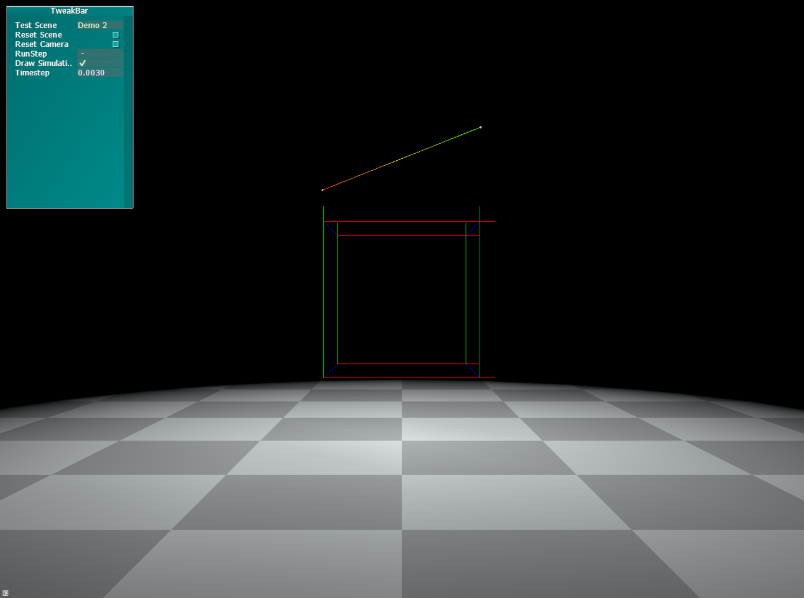
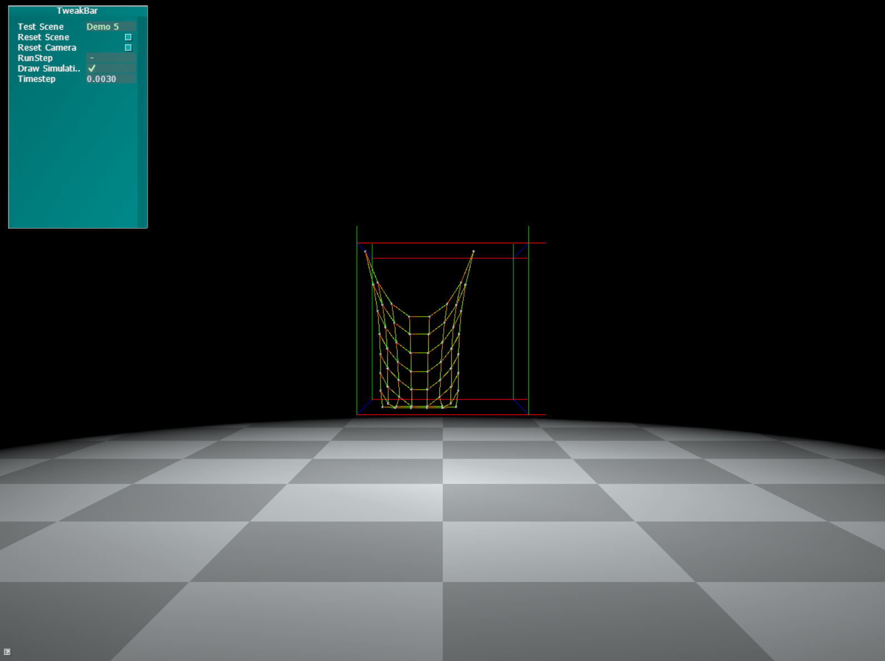
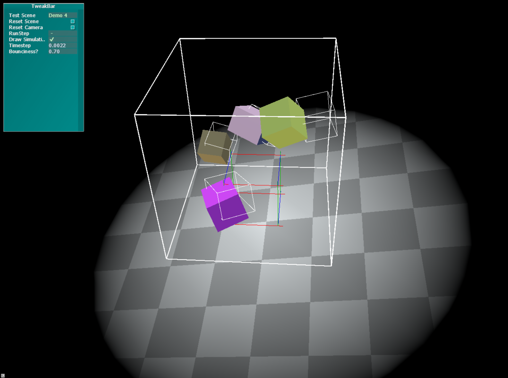
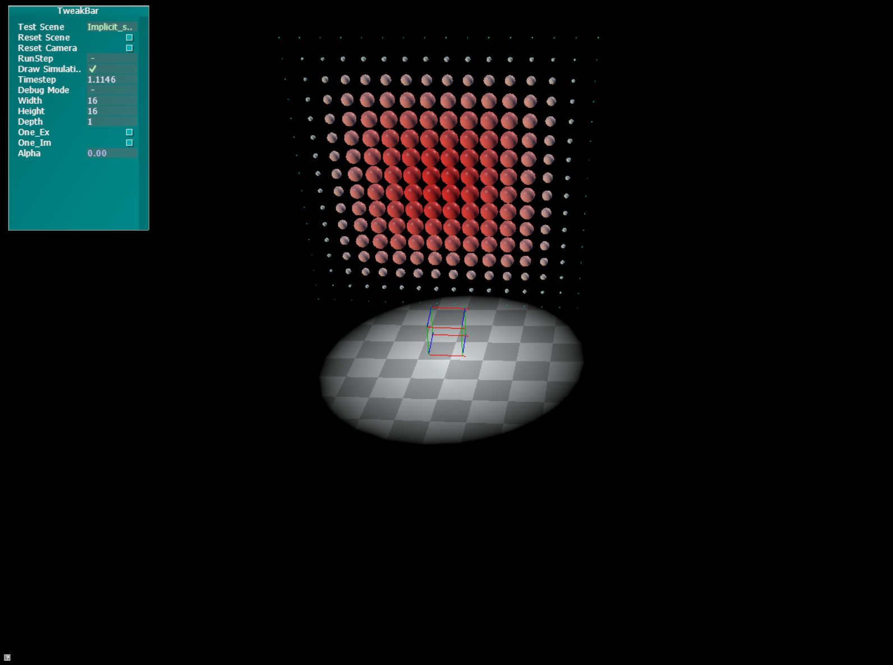
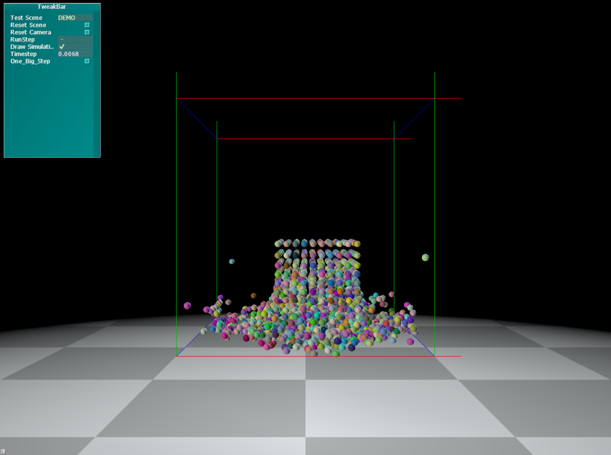

# GamePhysicsSimulation

This project includes four basic simulation in Game Physic field. For switching between different Simulation, you can change the marcos in [`main.cpp`](Simulations/main.cpp) `Line 24 - 28`.

- Simulation 1 => MassSpring System
  
| Single Spring| Mesh |
| :-------------------: | -----------------: |
|  |  |

  
- Simulation 2 => RigidBody Collision

| Multiple Rigid Bodies Collision | 
| :-------------------: | 
|  | 

- Simulation 3 => Heat Diffusion ([Explicit solver and Implicit Solver](http://hplgit.github.io/num-methods-for-PDEs/doc/pub/diffu/sphinx/._main_diffu001.html))

| Heat Implicit Diffusion | 
| :-------------------: | 
|  | 

- Simulation 4 => SPH simulation

| Smoothed-particle hydrodynamics Simulation | 
| :-------------------: | 
|  | 

## Dependencies 

This solution contains the following components:

 - [AntTweakBar](http://anttweakbar.sourceforge.net/)
   "AntTweakBar is a small and easy-to-use C/C++ library that allows program-
   mers to quickly add a light and intuitive graphical user interface into 
   graphic applications based on OpenGL (compatibility and core profiles), 
   DirectX 9, DirectX 10 or DirectX 11 to interactively tweak parameters 
   on-screen."

 - [DirectX Tool Kit](https://github.com/Microsoft/DirectXTK)
   (the 'MakeSpriteFont' project is part of the DirectXTK)
   "The DirectX Tool Kit (aka DirectXTK) is a collection of helper classes for
   writing Direct3D 11 code in C++."

 - [DXUT](https://github.com/Microsoft/DXUT)
   "DXUT is a "GLUT"-like framework for Direct3D 11.x Win32 desktop 
   applications; primarily samples, demos, and prototypes."

 - [Effects 11 (FX11)](ttps://github.com/Microsoft/FX11)

## Main Project
[`main.cpp`](Simulations/main.cpp): Structured like a typical DXUT-based application. It contains example code that correctly integrates and demonstrates how to use AntTweakBar (for a simple GUI) and DirectXTK (for simple, "fixed-function" rendering of common primitives).

[`effect.fx`](Simulations/effect.fx): Starting point for custom shaders, already loaded in [`main.cpp`](Simulations/main.cpp). If  you don't need custom shaders, you can safely ignore or even delete it (and any code related to `g_pEffect` in [`main.cpp`](Simulations/main.cpp)).
	 
## Members

Chang Luo

Guanyu Chen

Taro Yoshioksa 

## License
MIT